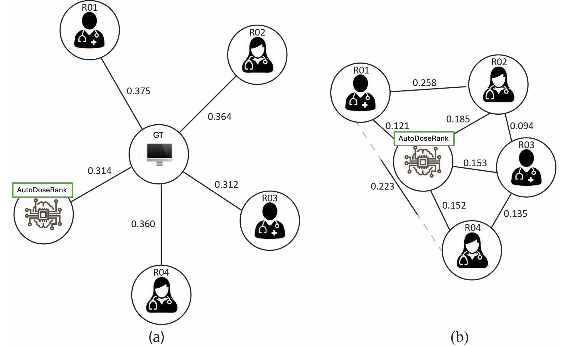

# autodoserank

This repository includes code accompanying our CaPTion@MICCAI 2024 paper on Automated Dosimetric Segmentation Ranking.

Normalized Distance-based Performance Measure (NDPM) visualization with scaled distance lengths representing value: (a) NDPM compared to Eclipse (ground truth) with a scaled distance of 0.75 (b) Cross-references between Auto- DoseRank and the radiation oncologists with scaled distance of 1. Note: RO1 vs RO4 shown with a dotted line; black continuous line indicates correct scale.

## Abstract 

AutoDoseRank (Automated Dosimetry-informed Segmentation Ranking) is a novel methodology for ranking segmentations of glioblastoma, 
a highly aggressive brain tumor, by dosimetric quality. AutoDoseRank uses a deep learning-based dose predictor along with a 
dosimetric ranking scheme capable of sorting a set of candidate segmentations by quality. With the advent of auto-segmentation 
for radiotherapy, we expect that radiation oncologists will spend more time triaging and evaluating the quality of generated 
segmentation proposals rather than manually drawing them. It is known that changes in segmentation evaluated purely through a 
geometric lens like Dice, do not correlate with eventual clinical outcomes. Our approach therefore aims to incorporate 
organ-specific dosimetric constraints used in clinical radiotherapy planning into a patient-level ranking. 

The effectiveness of AutoDoseRank is measured by comparing its ability to rank segmentations against that of four expert 
radiation oncologists. We show that AutoDoseRank is better than three out of four experts while being only slightly 
outperformed by the most experienced and meticulous one. These results highlight AutoDoseRank’s capability to monitor 
the quality of auto-segmentation dosimetrically, something that is ever increasing in importance in the radiation oncology 
workflow. Code to reproduce this analysis is available at https://github.com/ubern-mia/autodoserank

## How to run:

TBD