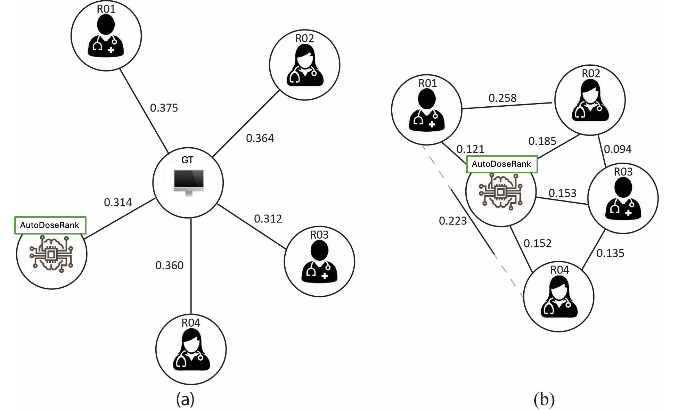

# AutoDoseRank

   

This repository contains code and experiments for our MICCAI 2024 Workshop paper:

**AutoDoseRank: Automated Dosimetry-informed Segmentation Ranking for Radiotherapy**  

Zahira Mercado, Amith Kamath, Robert Poel, Jonas Willmann, Ekin Ermis, Elena Riggenbach, Lucas Mose, Nicolaus Andratschke, Mauricio Reyes

*MICCAI 2024 Workshop on Cancer Prevention, detection, and intervenTion*

Read the paper [here](https://link.springer.com/chapter/10.1007/978-3-031-73376-5_21).  

## Overview

AutoDoseRank is a deep learning-based framework for ranking multiple tumor segmentation candidates based on **dosimetric quality**, rather than conventional geometric metrics like Dice. This is motivated by the fact that minor changes in segmentation geometry can have significant downstream effects on radiotherapy dose distributions, impacting tumor control and healthy tissue toxicity.



AutoDoseRank consists of:
- A deep learning-based **dose prediction model** that estimates 3D dose distributions for given segmentations.
- A **ranking metric** that compares dose distributions of candidate segmentations against an original plan, using clinically relevant constraints and priorities for each organ-at-risk (OAR).
- A final **ranking** based on computed dose impact (DI) values.

We demonstrate that AutoDoseRank outperforms three out of four radiation oncologists in ranking segmentations by dose impact, and performs comparably to the most experienced expert.

## Components

- **Dose Prediction**  
  Uses a cascaded 3D UNet-based dose predictor trained to estimate dose maps from segmentation input.

- **Dosimetric Impact Metric**  
  Estimates the deviation from a baseline plan using a normalized difference in OAR-specific dose values, scaled by clinical constraints and weighted by OAR priority.

- **Candidate Ranking**  
  Ranks all segmentation candidates for a patient by their total dose impact score (lower is better).

## Dataset

The study was conducted on:
- **13 Glioblastoma patients**
- Each with 1 original and 4 manually modified segmentation candidates
- Data includes CT, T1c MR, 13 OAR masks, tumor segmentation, Eclipse-computed ground truth dose maps, and predicted dose maps
- Dose plans follow standard VMAT protocols (30×2 Gy fractions), using the AAA algorithm and optimized in Eclipse TPS

> Note: The dataset is not publicly available. Contact authors for potential access.

## Evaluation

Segmentations were ranked by:
- **AutoDoseRank**
- **4 experienced radiation oncologists**
- **Ground truth** (based on Eclipse-computed dose maps)

Metrics used:
- **Normalized Distance-based Performance Measure (NDPM)**
- **Kendall's Tau** rank correlation (with bootstrapped 90% CIs)

Key results:
- AutoDoseRank shows strong agreement with ground truth (NDPM and Kendall’s Tau)
- Performs better than 3 out of 4 radiation oncologists
- Comparable to the most experienced expert (RO-3)

## Setup

### Installation

```bash
git clone https://github.com/amithjkamath/autodoserank.git
cd autodoserank
uv venv .venv
uv pip install -r pyproject.toml
```

Run generate_figure_*.py to reproduce the analysis.

## Example Visualizations

Visualizations of segmentations and rankings were performed using [3D Slicer](https://www.slicer.org/).

## Citation

If you use this work in your research, please cite:

    @inproceedings{mercado2024autodoserank,
    title={AutoDoseRank: Automated Dosimetry-Informed Segmentation Ranking for Radiotherapy},
    author={Mercado, Zahira and Kamath, Amith and Poel, Robert and Willmann, Jonas and Ermis, Ekin and Riggenbach, Elena and Mose, Lucas and Andratschke, Nicolaus and Reyes, Mauricio},
    booktitle={MICCAI Workshop on Cancer Prevention through Early Detection},
    pages={221--230},
    year={2024},
    organization={Springer}
    }
